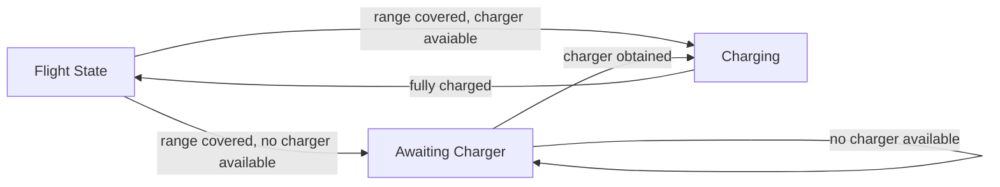

# eVTOL simulator

## Software Architecture

```mermaid
graph TD
    A-->B
    A-->C
    B-->D
    C-->D
```

## Aircraft State Machine

```mermaid
flowchart LR;
    A--range covered, no charger available-->B[Awaiting Charger];
    A[Flight State]--range covered, charger avaiable-->C[Charging];
    C--fully charged-->A;
    B-- charger obtained -->C;
    B-- no charger available --> B
```
## Testing

### Unit Testing

### Integration Testing

## TODOs in the design