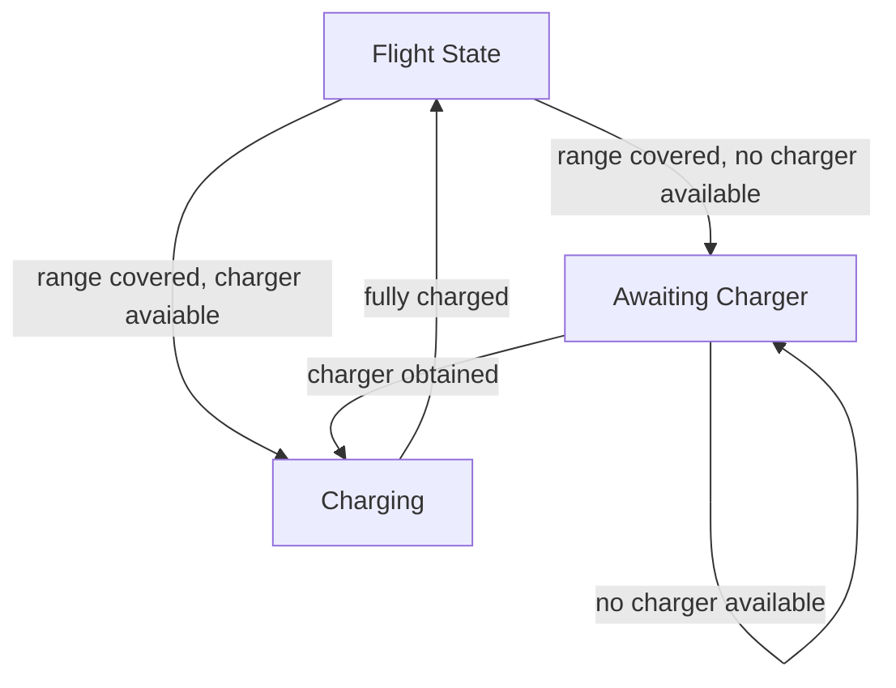
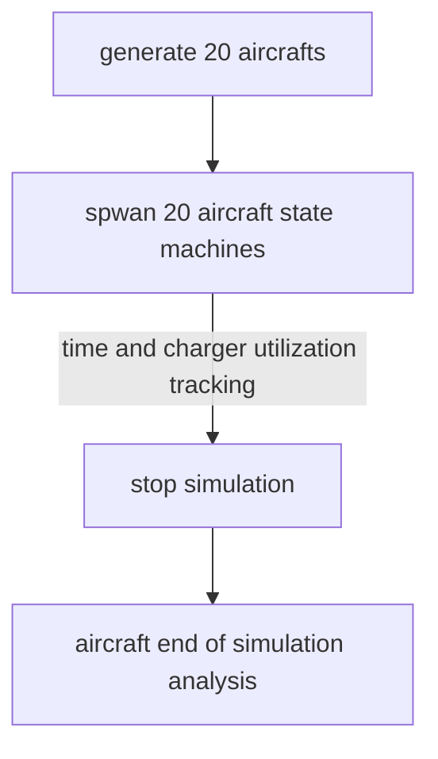

# eVTOL simulator
** TODO **

## Build Instructions
In the eVTOL_sim directory ...\
`make eVTOL_sim`\
or\
`make all`\
To build the simulator and the necessary classes and dependencies.

## Run Instructions
To run the simulator, run the following\
`./eVTOL_sim_run.sh`

## Software Architecture
** TODO **

### Aircraft State Machine
This is a very basic state machine for tracking the aircraft events. The assumption provided was that the aircraft has full charge and flies with the start of the simulation. So each aircraft would fly until the charge goes down completely (determined by max range at full charge). The aircraft then faces a decision whether to charge or wait depending upon charger availability. If it gets a charger, it charges and flies after getting fully charged, else it waits for the charger.

## Simulation Flow

## TODOs in the design
### State Machine Class
* Add an init method to update the following 3 variables and make them private.
* Encapsulate the flow of time track in a state in a common function as its common across states.
* Charger utlization to be tracked properly. Currently the logs are through std::cout but needs a thread safe way of doing it.
* Accuracy achievement in time tracking can happen with floats and doubles. Further, timer interrupts can be explored to track event durations.
* charging station mutexes can be encapsulated in a class and the pointer can be shared accordingly.
* The mutexes can be further made as a base class so that they can be mocked in the state machine unit test.
### Aircraft Class
* The State Machine object is specific to an Aircraft class object. The Class implementation should be modified to either completely encapsulate the creation and usage of the state machine class object or initialize the state machine object outside the aircraft object and perform a clean dependency injection.
### Simulation Run
* This currently acts as an integration test in a way. The current implementation only spawns 5 aircrafts of each of the 5 types. The tests that are required are further illustrated in the next section.
* A common utility class housing the random number of aircraft counts, calculating flight times in one charge, and aircraft paramter population.  
* Timer interrupts can be explored to track simulation duration. 
* A better way of spawning 20 aircrafts can be explored.
* .xls file can be created to populate simulation results.
* Logging facility to track events for each aircraft and charging station availability to verify correct operation.  

## Testing
### Unit Testing
Unit testing wasn't covered in stipulated time unfortunately. But this would be my approach.
* Every method in the state machine can be unit tested for functionality based on mocked mutex resources for line coverage.
* The State Machine functionality can be tested under various scenarios by modifying max flight and charging times and simulating charger availabilities.
* The Aircraft Class can be unit tested for initializations, state machine thread control, and result calculations.
### Integration Testing
The solution provided here is an instance of integration testing to some extent. This is a specific case to see correct initializations of aircrafts and their state machine threads and further verifying simulation calculations.
* Each aircraft type can be tested standalone for flight and charging times. Wait times can be tested by introducing multiple aircrafts and blocking all chargers.
* A comprehensive integration test would mean spawning 20 aircrafts with known quantities of each so that they can be verified against charger usage and time durations per event.