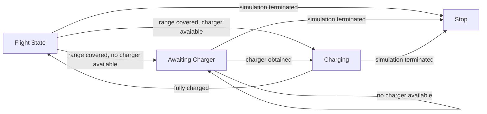
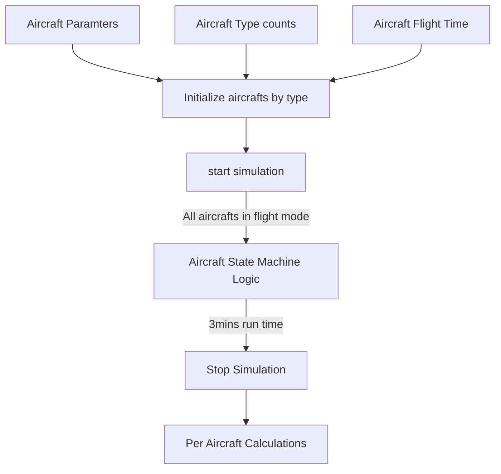

# eVTOL simulator
The simulator application simulates a scenario where 20 aircrafts of 5 different types start together and based on their battery and flight characteristics engage with 3 available charging stations are charging. The simulator runs for 3 minutes equivalent to 3 hours of simulation. The simulator provides an analysis into flight, charging, and waiting times and further statistics on faults and passenger miles.

Presentation: https://docs.google.com/presentation/d/1xEJ6-G8morgK9xSIDz9HsbbmrcB51Ya7rDO4I3VhAQc/edit#slide=id.g1093b9b6602_0_132

## Build Instructions
In the eVTOL_sim directory ...\
`make eVTOL_sim`\
or\
`make all`\
To build the simulator and the necessary classes and dependencies.

## Run Instructions
To run the simulator, run the following after building\
`./eVTOL_sim_run.sh`

## Software Architecture
The simulator heavily relies on the aircraft class which inturn relies on the state machine logic. The simulator setups the flow of the simulation. The aircraft class intiatizes the aircraft parameters and its state. Its also, responsible to start and stop the state machine. The state machine class houses the flight and charging logic as per the given situation. More details in the following sub-section.
A util class is needed to encapsulate simulator calculations and config handling.

#### Given Information.
* 5 Aircraft Companies with their unique parameters.
* 3 minutes for simulation time. (3 hours in simulator world)
* 20 random aircrafts, fully charged.
* 3 chargers.
* Instantaneous state transitions.
#### Calculations Required.
* Total Average Times - flying, charging, waiting for a charger.
* Maximum faults during flights.
* Passenger miles.

### Aircraft State Machine
This is a very basic state machine for tracking the aircraft events. The assumption provided was that the aircraft has full charge and flies with the start of the simulation. So each aircraft would fly until the charge goes down completely (determined by max range at full charge). The aircraft then faces a decision whether to charge or wait depending upon charger availability. If it gets a charger, it charges and flies after getting fully charged, else it waits for the charger.

### Simulation Flow


## Testing
### Unit Testing
Unit testing wasn't covered in stipulated time unfortunately. But this would be my approach.
* Every method in the state machine can be unit tested for functionality based on mocked mutex resources for line coverage.
* The State Machine functionality can be tested under various scenarios by modifying max flight and charging times and simulating charger availabilities.
* The Aircraft Class can be unit tested for initializations, state machine thread control, and result calculations.
### Integration Testing
The solution provided here is an instance of integration testing to some extent. This is a specific case to see correct initializations of aircrafts and their state machine threads and further verifying simulation calculations.
* Each aircraft type can be tested standalone for flight and charging times. Wait times can be tested by introducing multiple aircrafts and blocking all chargers.
* A comprehensive integration test would mean spawning 20 aircrafts with known quantities of each so that they can be verified against charger usage and time durations per event.

## Current Simulation Results
```
**** eVTOL SIMULATION **** 
eVTOL sim: Initializing ...
100 39 37 100 51 <-- Aircraft max flight times in minutes.
8 7 3 1 1 <-- Aircraft counts.
eVTOL sim: Initialization COMPLETE.
eVTOL sim: Simualtion Beginning ... 
Aircraft ID: [2] @ Charging Station [1]
Aircraft ID: [1] @ Charging Station [2]
Aircraft ID: [1] --- CHARGED.
Aircraft ID: [4] @ Charging Station [2]
Aircraft ID: [4] --- CHARGED.
Aircraft ID: [2] --- CHARGED.
Aircraft ID: [1] @ Charging Station [1]
Aircraft ID: [0] @ Charging Station [2]
Aircraft ID: [3] @ Charging Station [3]
Aircraft ID: [1] --- CHARGED.
Aircraft ID: [4] @ Charging Station [1]
Aircraft ID: [0] --- CHARGED.
Aircraft ID: [2] @ Charging Station [2]
Aircraft ID: [3] --- CHARGED.
Aircraft ID: [4] --- CHARGED.
Aircraft ID: [1] @ Charging Station [1]
Aircraft ID: [1] --- CHARGED.
eVTOL sim: Simulation COMPLETE.
eVTOL sim: Calculations Beginning ... 
eVTOL sim: Calculations COMPLETE.
------------------
PER AIRCRAFT RESULTS
------------------
Aircraft id [0]
avg_flight_time_minutes = 143
avg_time_charging_minutes = 36
avg_time_waiting_minutes = 0
max_numb_faults = 0.595833
passenger_miles = 1144
------------------
Aircraft id [1]
avg_flight_time_minutes = 143
avg_time_charging_minutes = 36
avg_time_waiting_minutes = 0
max_numb_faults = 0.238333
passenger_miles = 1191
------------------
Aircraft id [2]
avg_flight_time_minutes = 74
avg_time_charging_minutes = 91
avg_time_waiting_minutes = 14
max_numb_faults = 0.0616667
passenger_miles = 592
------------------
Aircraft id [3]
avg_flight_time_minutes = 142
avg_time_charging_minutes = 37
avg_time_waiting_minutes = 0
max_numb_faults = 0.520667
passenger_miles = 425
------------------
Aircraft id [4]
avg_flight_time_minutes = 143
avg_time_charging_minutes = 36
avg_time_waiting_minutes = 0
max_numb_faults = 1.45383
passenger_miles = 143
------------------
```

## TODOs in the design
### State Machine Class
* Add an init method to update the following 3 variables and make them private.
* Encapsulate the flow of time track in a state in a common function as its common across states.
* Charger utlization to be tracked properly. Currently the logs are through std::cout but needs a thread safe way of doing it.
* Accuracy achievement in time tracking can happen with floats and doubles. Further, timer interrupts can be explored to track event durations.
* charging station mutexes can be encapsulated in a class and the pointer can be shared accordingly.
* The mutexes can be further made as a base class so that they can be mocked in the state machine unit test.
### Aircraft Class
* The State Machine object is specific to an Aircraft class object. The Class implementation should be modified to either completely encapsulate the creation and usage of the state machine class object or initialize the state machine object outside the aircraft object and perform a clean dependency injection.
### Simulation Run
* This currently acts as an integration test in a way. The current implementation only spawns 5 aircrafts of each of the 5 types. The tests that are required are further illustrated in the next section.
* A common utility class housing the random number of aircraft counts, calculating flight times in one charge, and aircraft paramter population.  
* Timer interrupts can be explored to track simulation duration. 
* A better way of spawning 20 aircrafts can be explored.
* .xls file can be created to populate simulation results.
* Logging facility to track events for each aircraft and charging station availability to verify correct operation.  
